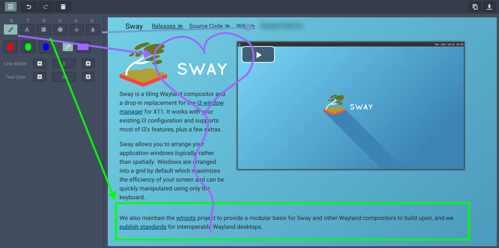

# swappy

A Wayland native snapshot and editor tool, inspired by [Snappy] on macOS. Works great with [grim], [slurp] and [sway]. But can easily work with other screen copy tools that can output a final image to `stdout`. See [below](#example-usage).

## Screenshot



## Example usage

Output of `grim` (or any tool outputting an image file):

```sh
grim -g "$(slurp)" - | swappy -f -
```

Swappshot a PNG file:

```sh
swappy -f "~/Desktop/my-gnome-saved-file.png"
```

Print final surface to stdout (useful to pipe with other tools):

```sh
grim -g "$(slurp)" - | swappy -f - -o - | pngquant -
```

Grab a swappshot from a specific window under Sway, using `swaymsg` and `jq`:

```sh
grim -g "$(swaymsg -t get_tree | jq -r '.. | select(.pid? and .visible?) | .rect | "\(.x),\(.y) \(.width)x\(.height)"' | slurp)" - | swappy -f -
```

## Config

The config file is located at `$XDG_CONFIG_HOME/swappy/config` or at `$HOME/.config/swappy/config`.

The file follows the GLib `conf` format. See the `man` page for details. There is example config file [here](example/config).

The following lines can be used as swappy's default:

```
[Default]
save_dir=$HOME/Desktop
save_filename_format=swappy-%Y%m%d-%H%M%S.png
show_panel=false
line_size=5
text_size=20
text_font=sans-serif
paint_mode=brush
early_exit=false
fill_shape=false
auto_save=false
```

- `save_dir` is where swappshots will be saved, can contain env variables, when it does not exist, swappy attempts to create it first, but does not abort if directory creation fails
- `save_filename_format`: is the filename template, if it contains a date format, this will be parsed into a timestamp. Format is detailed in [strftime(3)](https://man.archlinux.org/man/strftime.3). If this date format is missing, filename will have no timestamp
- `show_panel` is used to toggle the paint panel on or off upon startup
- `line_size` is the default line size (must be between 1 and 50)
- `text_size` is the default text size (must be between 10 and 50)
- `text_font` is the font used to render text, its format is pango friendly
- `paint_mode` is the mode activated at application start (must be one of: brush|text|rectangle|ellipse|arrow|blur, matching is case-insensitive)
- `early_exit` is used to make the application exit after saving the picture or copying it to the clipboard
- `fill_shape` is used to toggle shape filling (for the rectangle and ellipsis tools) on or off upon startup
- `auto_save` is used to toggle auto saving on exit the application

## Keyboard Shortcuts

- `Ctrl+b`: Toggle Paint Panel

<hr>

- `b`: Switch to Brush
- `t`: Switch to Text
- `r`: Switch to Rectangle
- `o`: Switch to Ellipse
- `a`: Switch to Arrow
- `d`: Switch to Blur (`d` stands for droplet)

<hr>

- `R`: Use Red Color
- `G`: Use Green Color
- `B`: Use Blue Color
- `C`: Use Custom Color
- `Minus`: Reduce Stroke Size
- `Plus`: Increase Stroke Size
- `Equal`: Reset Stroke Size
- `f`: Toggle Shape Filling
- `k`: Clear Paints (cannot be undone)

<hr>

- `Ctrl`: Center Shape (Rectangle & Ellipse) based on draw start

<hr>

- `Ctrl+z`: Undo
- `Ctrl+Shift+z` or `Ctrl+y`: Redo
- `Ctrl+s`: Save to file (see man page)
- `Ctrl+c`: Copy to clipboard
- `Escape` or `q` or `Ctrl+w`: Quit swappy

## Limitations

- **Copy**: If you don't have [wl-clipboard] installed, copy to clipboard won't work if you close swappy (the content of the clipboard is lost). This because GTK 3.24 [has not implemented persistent storage on wayland backend yet](https://gitlab.gnome.org/GNOME/gtk/blob/3.24.13/gdk/wayland/gdkdisplay-wayland.c#L857). We need to do it on the [Wayland level](https://github.com/swaywm/wlr-protocols/blob/master/unstable/wlr-data-control-unstable-v1.xml), or wait for GTK 4. For now, we use `wl-copy` if installed and revert to `gtk` clipboard if not found.
- **Fonts**: Swappy relies on Font Awesome 5 being present to properly render the icons. On Arch you can simply install those with: `sudo pacman -S otf-font-awesome`

## Installation

- [Arch Linux](https://archlinux.org/packages/extra/x86_64/swappy/)
- [Arch Linux (git)](https://aur.archlinux.org/packages/swappy-git)
- [Fedora](https://src.fedoraproject.org/rpms/swappy)
- [Gentoo](https://packages.gentoo.org/packages/gui-apps/swappy)
- [openSUSE](https://build.opensuse.org/package/show/X11:Wayland/swappy)
- [Void Linux](https://github.com/void-linux/void-packages/tree/master/srcpkgs/swappy)

## Building from source

Install dependencies (on Arch, name can vary for other distros):

- meson
- ninja
- cairo
- pango
- gtk
- glib2
- scdoc

Optional dependencies:

- `wl-clipboard` (to make sure the copy is saved if you close swappy)
- `otf-font-awesome` (to draw the paint icons properly)

Then run:

```sh
meson setup build
ninja -C build
```

### i18n

This section is for developers, maintainers and translators.

To add support to a new locale or when translations are updated:

1. Update `src/po/LINGUAS` (when new locales are added)
2. Generate a new `po` file (ignore and do not commit potential noise in other files):

```sh
ninja -C build swappy-update-po
```

To rebuild the base template (should happen less often):

```sh
ninja -C build swappy-pot
```

See the [meson documentation](https://mesonbuild.com/Localisation.html) for details.

## Contributing

Pull requests are welcome. This project uses [conventional commits](https://www.conventionalcommits.org/en/v1.0.0/) to automate changelog generation.

## Release

We rely on [standard-version](https://github.com/conventional-changelog/standard-version) which is part of the JavaScript ecosystem but works well with any project.

```sh
./script/github-release
```

Make sure everything is valid in the Draft release, then publish the draft.

Release tarballs are signed with this PGP key: `F44D05A50F6C9EB5C81BCF966A6B35DBE9442683`

## License

MIT

[snappy]: http://snappy-app.com/
[slurp]: https://github.com/emersion/slurp
[grim]: https://github.com/emersion/grim
[sway]: https://github.com/swaywm/sway
[wl-clipboard]: https://github.com/bugaevc/wl-clipboard
