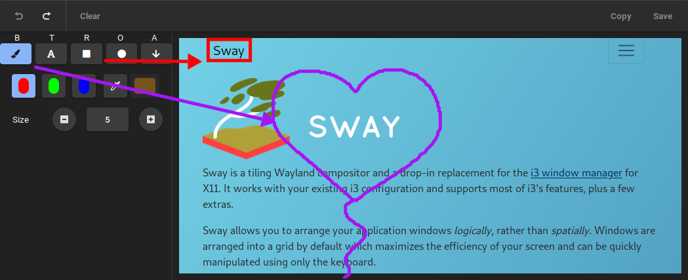

# swappy

A Wayland and X11 native snapshot and editor tool, inspired by [Snappy] on macOS. Works great with [grim], [slurp] and [sway]. But can also work for with other screenshot tools if you use the `-f` option. See below.

Wayland code was largely taken from [grim], needs a compositor that implements the [wlr-screencopy-unstable-v1.xml] protocol.

You can use this tool in two ways, either use it as the output of `grim` (**recommended**) or grab the geometry yourself.

## Screenshot



## Example usage

Output of `grim` (or any tool outputing a PNG file):

```sh
grim -g "$(slurp)" - | swappy -f -
```

Swappshot a PNG file (good for compositors not supporting screencopy protocol):

```sh
swappy -f "~/Desktop/my-gnome-saved-file.png"
```

Swappshot a region:

```sh
swappy -g "100,100 200x200"
```

Select a region and swappshot it:

```sh
swappy -g "$(slurp)"
```

Grab a swappshot from a specific window under Sway, using `swaymsg` and `jq`:

```sh
grim -g "$(swaymsg -t get_tree | jq -r '.. | select(.pid? and .visible?) | .rect | "\(.x),\(.y) \(.width)x\(.height)"' | slurp)" - | swappy -f -
# Or
swappy -g "$(swaymsg -t get_tree | jq -r '.. | select(.pid? and .visible?) | .rect | "\(.x),\(.y) \(.width)x\(.height)"' | slurp)"
```

## Keyboard Shortcuts

- `Ctrl+b`: Toggle Paint Panel

<hr>

- `b`: Switch to Brush
- `t`: Switch to Text
- `r`: Switch to Rectangle
- `o`: Switch to Ellipse
- `a`: Switch to Arrow

<hr>

- `R`: Use Red Color
- `G`: Use Green Color
- `B`: Use Blue Color
- `C`: Use Custom Color
- `Minus`: Reduce Stroke Size
- `Plus`: Increase Stroke Size
- `Equal`: Reset Stroke Size
- `k`: Clear Paints (cannot be undone)

<hr>

- `Ctrl+z`: Undo
- `Ctrl+Shift+z` or `Ctrl+y`: Redo
- `Ctrl+s`: Save to file (see man page)
- `Ctrl+c`: Copy to clipboard
- `Escape` or `q`: Quit swappy

## Limitations

- **Copy**: Copy to clipboard won't work if you close swappy (the content of the clipboard is lost). This because GTK 3.24 [has not implemented persistent storage](https://gitlab.gnome.org/GNOME/gtk/blob/3.24.13/gdk/wayland/gdkdisplay-wayland.c#L857). We need to do it on the [Wayland level](https://github.com/swaywm/wlr-protocols/blob/master/unstable/wlr-data-control-unstable-v1.xml), or wait for GTK 4. For now, Paste your Swappshot where you want to before you close the app.

## Installation

### Arch Linux User Repository

Assuming [yay](https://aur.archlinux.org/packages/yay/) as your AUR package manager:

- **stable**: `yay -S swappy`
- **latest**: `yay -S swappy-git`

## Building from source

Install dependencies:

- meson
- wayland
- cairo
- pango
- gtk

Optional dependencies:

- wayland-protocols (for the `-g` option to work with `screencopy` protocol).
- libnotify (not get notified when swappshot is copied or saved).
- scdoc to generate the man page

Then run:

```sh
meson build
ninja -C build
```

## Contributing

Pull requests are welcome.

## License

MIT

[snappy]: http://snappy-app.com/
[slurp]: https://github.com/emersion/slurp
[grim]: https://github.com/emersion/grim
[sway]: https://github.com/swaywm/sway
[wlr-screencopy-unstable-v1.xml]: https://github.com/swaywm/wlr-protocols/blob/master/unstable/wlr-screencopy-unstable-v1.xml
